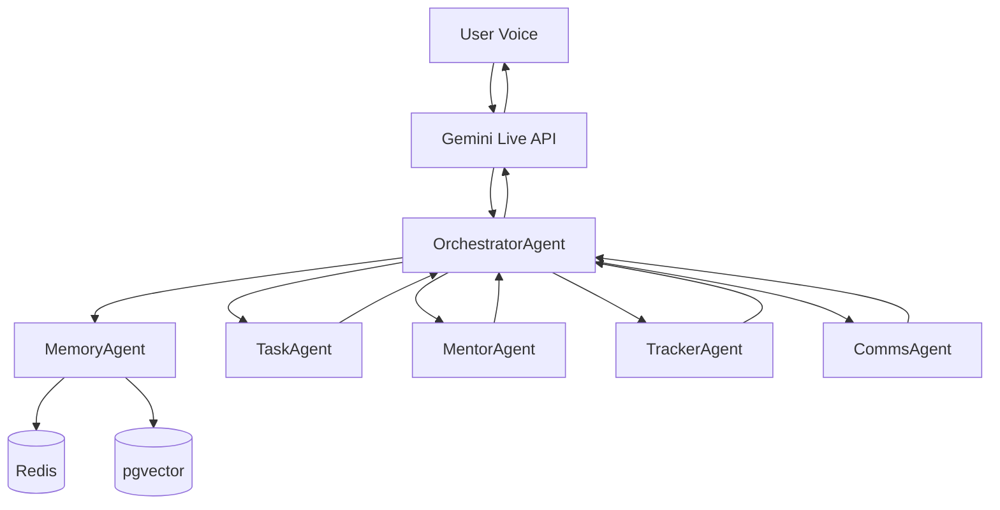

# ORBIT

Orbit is a voice-first personal AI OS. You speak — Orbit understands the intent, routes it to the right agent, and replies by voice. Instead of switching between five apps, you talk to one interface.

---

## Architecture



---

## Tech Stack

| Layer     | Tool                          |
|-----------|-------------------------------|
| Voice     | Gemini Live API               |
| Brain     | Gemini 2.5 via Google ADK     |
| Agents    | Python 3.11, one file each    |
| Memory    | Redis + PostgreSQL + pgvector |
| Infra     | AWS Lambda + API Gateway      |
| Frontend  | React + Tailwind              |
| Testing   | pytest + Playwright + Evals   |
| CI        | GitHub Actions                |

---

## Folder Structure

```
orbit/
  agents/
    orchestrator.py     # master router — classifies intent, fans out to agents
    task_agent.py       # Google Calendar events + GitHub PR status
    mentor_agent.py     # 10-part teaching engine via Gemini 2.5
    tracker_agent.py    # LeetCode log, DSA streaks, topic progress
    comms_agent.py      # Gmail + Calendar read/send via MCP
    memory_agent.py     # Redis session + pgvector long-term memory
  voice/
    gemini_live.py      # audio stream → text + intent via Gemini Live + TTS
  memory/
    redis_store.py      # session key-value store with TTL
    pgvector_store.py   # embed, store, semantic search via Gemini embeddings
  mcp/
    calendar_mcp.py     # Google Calendar REST wrapper
    gmail_mcp.py        # Gmail REST wrapper
    github_mcp.py       # GitHub REST wrapper
  infra/
    lambda_handler.py   # AWS Lambda entry point
    api_gateway.py      # FastAPI server (local + Lambda proxy)
  dashboard/
    src/
      App.jsx           # main layout — topbar, 2-col grid, log, input bar
      useOrbitData.js   # polling hook — connects to API, manages state
      panels/
        IntentPanel.jsx # last intent label + raw input text
        AgentPanel.jsx  # agents called, status badge, response time
        MemoryPanel.jsx # Redis keys (collapsible) + pgvector results
        VoicePanel.jsx  # waveform, transcript, Gemini Live latency
    tests/
      dashboard.spec.js # 9 Playwright tests covering all panels
    playwright.config.js
    package.json
  tests/
    unit/               # per-function unit tests (min 3 per function)
    integration/        # agent routing + memory flow + Lambda handler
    e2e/                # reserved for full voice loop e2e
  evals/
    orchestrator/       # intent classification accuracy evals → eval_results.jsonl
    mentor_agent/       # 10-part format correctness evals → eval_results.jsonl
    tracker_agent/      # data shape correctness evals → eval_results.jsonl
  test-results/
    playwright/         # HTML report, JSON results, screenshots, videos
  .env.example          # all required environment variables
  pyproject.toml        # dependencies and pytest config
  .github/workflows/
    ci.yml              # unit → integration → evals → playwright → summary
```

---

## How to Run Locally

```bash
# 1. Clone the repo
git clone https://github.com/UshanagallaShashank/Project-orbitary.git
cd Project-orbitary

# 2. Create virtual environment
python -m venv .venv
source .venv/bin/activate

# 3. Install dependencies
pip install -e ".[dev]"

# 4. Copy and fill env vars
cp .env.example .env
# Edit .env with your keys

# 5. Start Redis
docker run -d -p 6379:6379 redis:7-alpine

# 6. Start PostgreSQL with pgvector
docker run -d -p 5432:5432 \
  -e POSTGRES_DB=orbit \
  -e POSTGRES_USER=orbit_user \
  -e POSTGRES_PASSWORD=yourpassword \
  ankane/pgvector

# 7. Run the API server
uvicorn infra.api_gateway:app --reload --port 8080

# 8. Start the dashboard
cd dashboard && npm install && npm run dev
# Open http://localhost:5173
```

---

## Running Tests

```bash
# Unit tests only
pytest tests/unit/ -v

# Integration tests only
pytest tests/integration/ -v

# All evals (writes jsonl to evals/*/eval_results.jsonl)
pytest evals/ -v

# All tests + evals together
pytest tests/ evals/ -v

# Playwright (dashboard must be running on port 5173)
cd dashboard
npx playwright install chromium
npx playwright test

# Playwright with visible browser
npx playwright test --headed

# View Playwright HTML report
npx playwright show-report ../test-results/playwright
```

---

## Environment Variables

| Variable                   | What it does                                   |
|----------------------------|------------------------------------------------|
| `GEMINI_API_KEY`           | Auth for Gemini Live + Gemini 2.5 calls        |
| `GEMINI_MODEL`             | Model name for orchestrator and agents         |
| `GEMINI_LIVE_MODEL`        | Model name for voice streaming                 |
| `REDIS_HOST`               | Redis server hostname                          |
| `REDIS_PORT`               | Redis server port (default 6379)               |
| `REDIS_TTL_SECONDS`        | Session key expiry in seconds                  |
| `POSTGRES_HOST`            | PostgreSQL hostname                            |
| `POSTGRES_PORT`            | PostgreSQL port (default 5432)                 |
| `POSTGRES_DB`              | Database name                                  |
| `POSTGRES_USER`            | DB user                                        |
| `POSTGRES_PASSWORD`        | DB password                                    |
| `GOOGLE_CLIENT_ID`         | OAuth client for Calendar + Gmail              |
| `GOOGLE_CLIENT_SECRET`     | OAuth secret                                   |
| `GOOGLE_ACCESS_TOKEN`      | Bearer token for Calendar + Gmail API calls    |
| `GOOGLE_REDIRECT_URI`      | OAuth redirect URL                             |
| `GITHUB_TOKEN`             | PAT for GitHub MCP                             |
| `GITHUB_USERNAME`          | GitHub handle for TrackerAgent                 |
| `AWS_REGION`               | AWS deployment region                          |
| `AWS_LAMBDA_FUNCTION_NAME` | Lambda function name                           |
| `AWS_API_GATEWAY_URL`      | Deployed API Gateway base URL                  |
| `ORBIT_ENV`                | `development` or `production`                  |
| `ORBIT_PORT`               | Local server port                              |
| `LOG_LEVEL`                | Logging verbosity (`INFO`, `DEBUG`)            |

---

## How Each Agent Works

**OrchestratorAgent** — Receives the classified intent from Gemini Live, calls Gemini 2.5 to classify raw text into one of six intent labels (DSA, CALENDAR, MENTOR, TRACKER, MEMORY, COMMS), routes to the correct agent, merges responses, and returns a reply dict.

**TaskAgent** — Handles calendar-related actions (create, list, delete events) and GitHub status checks using HTTP wrappers around the Google Calendar and GitHub REST APIs. Takes structured intent from the orchestrator and returns structured results.

**MentorAgent** — Teaches any DSA or software concept using a fixed 10-part format: simple explanation, analogy, why it exists, how it works, code example, step-by-step, use cases, interview answer, common mistakes, quick summary. Returns valid JSON with all 10 keys populated by Gemini 2.5.

**TrackerAgent** — Tracks LeetCode problem solves, computes DSA solve-day streaks, and fetches progress by topic. Reads from and writes to a PostgreSQL `lc_solves` table. Returns plain numbers and topic labels.

**CommsAgent** — Reads and sends Gmail messages, and reads Calendar events via REST wrappers. Handles plain-language commands like "read my last three emails" or "send an email to X about Y."

**MemoryAgent** — Manages two memory layers: short-term (Redis, TTL-based session keys) and long-term (pgvector, Gemini text-embedding-004 semantic embeddings). Fetches relevant context before each orchestration cycle and writes new facts after.

---

## Request Flow

1. User speaks into the browser mic
2. Gemini Live streams audio → returns transcript
3. OrchestratorAgent receives transcript, calls Gemini 2.5 to classify intent
4. MemoryAgent fetches Redis session state + pgvector top-3 semantic matches
5. OrchestratorAgent routes to the relevant agent
6. Agent executes its task and returns a result dict
7. OrchestratorAgent merges results into a single reply
8. Reply sent to Gemini Live TTS → synthesised to voice → played to user
9. MemoryAgent writes new facts to Redis + pgvector

---

## How to Add a New Agent

1. Create `agents/your_agent.py` — one class, one `run(intent, context)` method
2. Add its intent label to `INTENT_LABELS` in `agents/orchestrator.py`
3. Register it in `AGENT_REGISTRY` in `agents/orchestrator.py`
4. Write unit tests in `tests/unit/test_your_agent.py` (min 3 per function)
5. Add integration test in `tests/integration/test_routing.py`
6. If it calls Gemini, add eval suite in `evals/your_agent/test_your_agent_eval.py`
7. Update this README under "How Each Agent Works"

---

## Playwright Results

Playwright test results are saved to `test-results/playwright/`:

- `index.html` — open in browser for full visual report with screenshots and traces
- `results.json` — machine-readable pass/fail per test case
- `screenshots/` — one PNG per panel state captured during the test run
- `videos/` — recordings saved on test failure

To open the report locally:
```bash
cd dashboard
npx playwright show-report ../test-results/playwright
```

CI uploads the full report as a GitHub Actions artifact on every run — download it from the Actions tab.

---

## Known Limitations

- Gemini Live API requires a stable network — no offline fallback
- pgvector semantic search returns top-3 results with no re-ranking step
- CommsAgent reads Gmail but cannot handle attachments
- TrackerAgent streak counts distinct solve-days in last 30 days, not consecutive days
- No multi-user support — session isolation is by session ID only, not auth tokens
- Lambda cold starts can add 800ms–2s on first request after idle
- Playwright tests require `GEMINI_API_KEY` secret in GitHub to test live intent routing

---

## Roadmap

- [x] F1  — Project setup, folder structure, README, CI stub
- [x] F2  — Gemini Live voice stream + intent extraction
- [x] F3  — OrchestratorAgent intent classification
- [x] F4  — MemoryAgent Redis session store
- [x] F5  — MemoryAgent pgvector semantic memory
- [x] F6  — TaskAgent Calendar + GitHub
- [x] F7  — TrackerAgent LeetCode + DSA streaks
- [x] F8  — MentorAgent 10-part format
- [x] F9  — CommsAgent Gmail + Calendar
- [x] F10 — Full voice loop end to end
- [x] F11 — Debug dashboard (React + Tailwind)
- [x] F12 — GitHub Actions full CI pipeline
- [ ] Multi-user auth with session isolation
- [ ] Attachment handling in CommsAgent
- [ ] pgvector re-ranking with cross-encoder
- [ ] Consecutive-day streak logic in TrackerAgent
- [ ] Mobile voice interface
