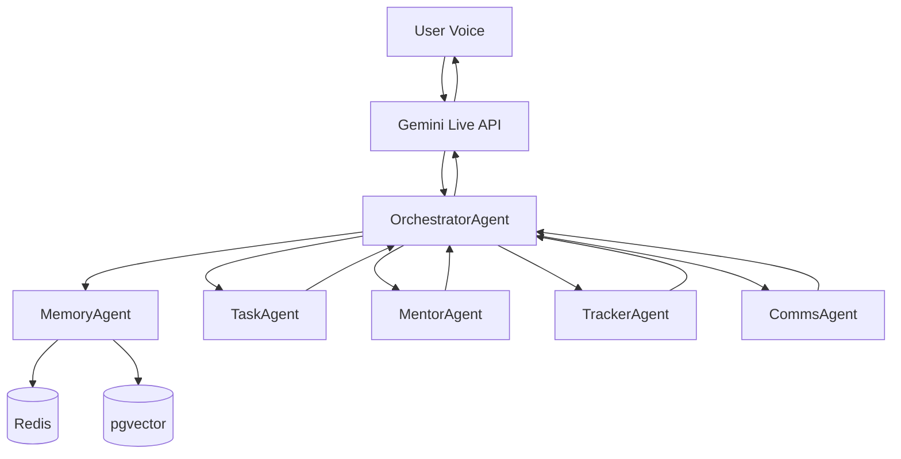

# ORBIT

Orbit is a voice-first personal AI OS. You speak — Orbit understands the intent, routes it to the right agent, and replies by voice. Instead of switching between five apps, you talk to one interface.

---

## Architecture



---

## Tech Stack

| Layer     | Tool                          |
|-----------|-------------------------------|
| Voice     | Gemini Live API               |
| Brain     | Gemini 2.5 via Google ADK     |
| Agents    | Python 3.11, one file each    |
| Memory    | Redis + PostgreSQL + pgvector |
| Infra     | AWS Lambda + API Gateway      |
| Frontend  | React + Tailwind              |
| Testing   | pytest + Playwright + Evals   |
| CI        | GitHub Actions                |

---

## Folder Structure

```
orbit/
  agents/
    orchestrator.py     # master router — classifies intent, fans out to agents
    task_agent.py       # Google Calendar events + GitHub status
    mentor_agent.py     # 10-part teaching engine via Gemini 2.5
    tracker_agent.py    # LeetCode log, DSA streaks, topic progress
    comms_agent.py      # Gmail + Calendar read/send via MCP
    memory_agent.py     # Redis session + pgvector long-term memory
  voice/
    gemini_live.py      # audio stream → text + intent via Gemini Live
  memory/
    redis_store.py      # session key-value store with TTL
    pgvector_store.py   # embed, store, semantic search
  mcp/
    calendar_mcp.py     # Google Calendar MCP wrapper
    gmail_mcp.py        # Gmail MCP wrapper
    github_mcp.py       # GitHub MCP wrapper
  infra/
    lambda_handler.py   # AWS Lambda entry point
    api_gateway.py      # API Gateway route config
  dashboard/
    src/                # React + Tailwind debug dashboard
  tests/
    unit/               # per-function unit tests
    integration/        # agent routing + memory flow tests
    e2e/                # full voice loop tests
  evals/
    orchestrator/       # intent classification accuracy evals
    mentor_agent/       # format and latency evals
    tracker_agent/      # data accuracy evals
  test-results/
    playwright/         # HTML report, JSON results, screenshots, videos
  .env.example          # all required environment variables
  pyproject.toml        # dependencies and pytest config
  .github/workflows/
    ci.yml              # CI pipeline: unit → integration → evals → playwright
```

---

## How to Run Locally

```bash
# 1. Clone the repo
git clone https://github.com/shashank/orbit.git
cd orbit

# 2. Create virtual environment
python -m venv .venv
source .venv/bin/activate

# 3. Install dependencies
pip install -e ".[dev]"

# 4. Copy and fill env vars
cp .env.example .env
# Edit .env with your keys

# 5. Start Redis
docker run -d -p 6379:6379 redis:7-alpine

# 6. Start PostgreSQL with pgvector
docker run -d -p 5432:5432 \
  -e POSTGRES_DB=orbit \
  -e POSTGRES_USER=orbit_user \
  -e POSTGRES_PASSWORD=yourpassword \
  ankane/pgvector

# 7. Run the API server
uvicorn infra.api_gateway:app --reload --port 8080

# 8. Start the dashboard
cd dashboard && npm install && npm run dev
```

---

## Running Tests

```bash
# Unit tests only
pytest tests/unit/ -v

# Integration tests only
pytest tests/integration/ -v

# E2E tests only
pytest tests/e2e/ -v

# All evals
pytest evals/ -v

# Playwright (dashboard must be running on port 5173)
cd dashboard
npx playwright test

# Playwright with visible browser
npx playwright test --headed

# View Playwright HTML report
npx playwright show-report test-results/playwright
```

---

## Environment Variables

| Variable                   | What it does                                   |
|----------------------------|------------------------------------------------|
| `GEMINI_API_KEY`           | Auth for Gemini Live + Gemini 2.5 calls        |
| `GEMINI_MODEL`             | Model name for OrchestratorAgent               |
| `GEMINI_LIVE_MODEL`        | Model name for voice streaming                 |
| `REDIS_HOST`               | Redis server hostname                          |
| `REDIS_PORT`               | Redis server port (default 6379)               |
| `REDIS_TTL_SECONDS`        | Session key expiry in seconds                  |
| `POSTGRES_HOST`            | PostgreSQL hostname                            |
| `POSTGRES_PORT`            | PostgreSQL port (default 5432)                 |
| `POSTGRES_DB`              | Database name                                  |
| `POSTGRES_USER`            | DB user                                        |
| `POSTGRES_PASSWORD`        | DB password                                    |
| `GOOGLE_CLIENT_ID`         | OAuth client for Calendar + Gmail              |
| `GOOGLE_CLIENT_SECRET`     | OAuth secret                                   |
| `GOOGLE_REDIRECT_URI`      | OAuth redirect URL                             |
| `GITHUB_TOKEN`             | PAT for GitHub MCP                             |
| `GITHUB_USERNAME`          | GitHub handle for TrackerAgent                 |
| `AWS_REGION`               | AWS deployment region                          |
| `AWS_LAMBDA_FUNCTION_NAME` | Lambda function name                           |
| `AWS_API_GATEWAY_URL`      | Deployed API Gateway base URL                  |
| `ORBIT_ENV`                | `development` or `production`                  |
| `ORBIT_PORT`               | Local server port                              |
| `LOG_LEVEL`                | Logging verbosity (`INFO`, `DEBUG`)            |

---

## How Each Agent Works

**OrchestratorAgent** — Receives the classified intent from Gemini Live, decides which agents to call and in what order (parallel where possible), merges all responses into a single reply, and sends it back to Gemini Live for voice output.

**TaskAgent** — Handles calendar-related actions (create, list, delete events) and GitHub status checks using MCP wrappers. Takes structured intent from the orchestrator and returns structured results.

**MentorAgent** — Teaches any DSA or software concept using a fixed 10-part format: simple explanation, analogy, why it exists, how it works, code example, step-by-step, use cases, interview answer, common mistakes, quick summary. Powered by Gemini 2.5.

**TrackerAgent** — Tracks LeetCode problem solves, computes DSA streaks, and fetches progress by topic. Reads from and writes to the PostgreSQL database. Returns plain numbers and topic labels.

**CommsAgent** — Reads and sends Gmail messages, and reads Calendar events via MCP. Handles plain-language commands like "read my last three emails" or "what's on my calendar tomorrow."

**MemoryAgent** — Manages two memory layers: short-term (Redis, TTL-based session keys) and long-term (pgvector, semantic embeddings). Fetches relevant context before each orchestration cycle and writes new facts after.

---

## Request Flow

1. User speaks into the browser mic
2. Gemini Live streams audio → returns transcript + raw intent label
3. OrchestratorAgent receives the intent with session ID
4. MemoryAgent fetches Redis session state + pgvector top-3 semantic matches
5. OrchestratorAgent fans out to relevant agents in parallel
6. Each agent executes its task and returns a result dict
7. OrchestratorAgent merges results into a single natural-language reply
8. Reply is sent to Gemini Live → synthesized to voice → played to user
9. MemoryAgent writes new facts to Redis + pgvector

---

## How to Add a New Agent

1. Create `agents/your_agent.py` — one class, one `run(intent, context)` method
2. Register it in `orchestrator.py` under the `AGENT_REGISTRY` dict
3. Add its intent label to the `INTENT_LABELS` list in `voice/gemini_live.py`
4. Write unit tests in `tests/unit/test_your_agent.py` (min 3 per function)
5. Add integration test in `tests/integration/test_routing.py`
6. If it calls Gemini, add an eval suite in `evals/your_agent/`
7. Update this README under "How Each Agent Works"

---

## Playwright Results

Playwright test results are saved to `test-results/playwright/`:

- `report.html` — open in browser for full visual report with screenshots and traces
- `results.json` — machine-readable pass/fail for each test case
- `screenshots/` — one PNG per panel state captured during the test run
- `videos/` — full video recordings of each test (saved on failure by default)

To open the report locally:
```bash
cd dashboard
npx playwright show-report ../test-results/playwright
```

---

## Known Limitations

- Gemini Live API requires a stable network connection — no offline fallback
- pgvector semantic search returns top-3 results; no re-ranking step yet
- CommsAgent reads Gmail but cannot handle attachments
- TrackerAgent LeetCode data is pulled from public GraphQL API — rate limits apply
- No multi-user support — session isolation is by session ID only, not auth
- Lambda cold starts can add 800ms–2s on first request

---

## Roadmap

- [ ] F2  — Gemini Live voice stream hello world
- [ ] F3  — OrchestratorAgent intent classification
- [ ] F4  — MemoryAgent Redis session store
- [ ] F5  — MemoryAgent pgvector semantic memory
- [ ] F6  — TaskAgent Calendar + GitHub
- [ ] F7  — TrackerAgent LeetCode + DSA streaks
- [ ] F8  — MentorAgent 10-part format
- [ ] F9  — CommsAgent Gmail + Calendar
- [ ] F10 — Full voice loop end to end
- [ ] F11 — Debug dashboard
- [ ] F12 — GitHub Actions full CI pipeline
- [ ] Multi-user auth with session isolation
- [ ] Attachment handling in CommsAgent
- [ ] pgvector re-ranking with cross-encoder
- [ ] Mobile voice interface
